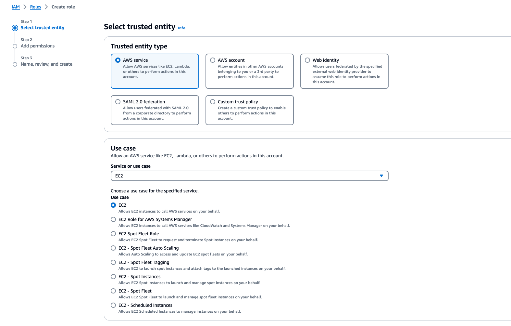
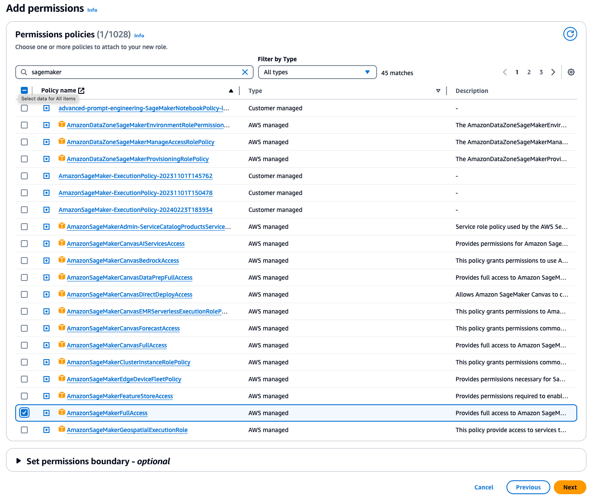
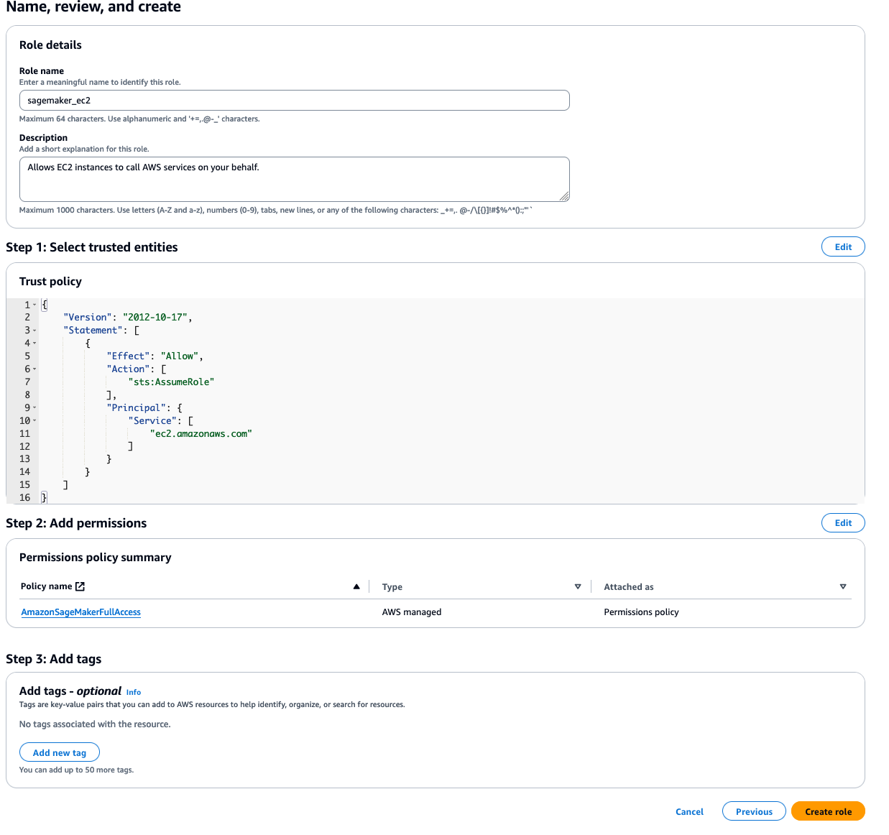
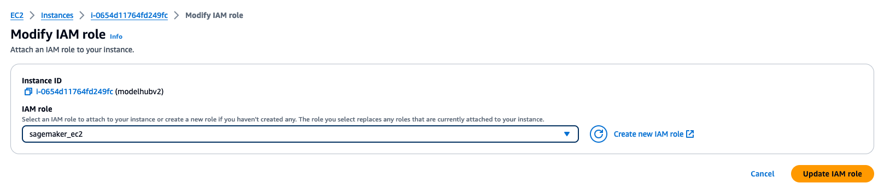
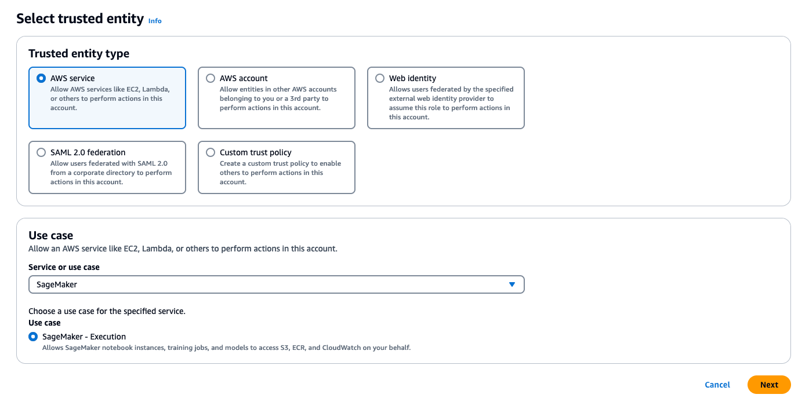
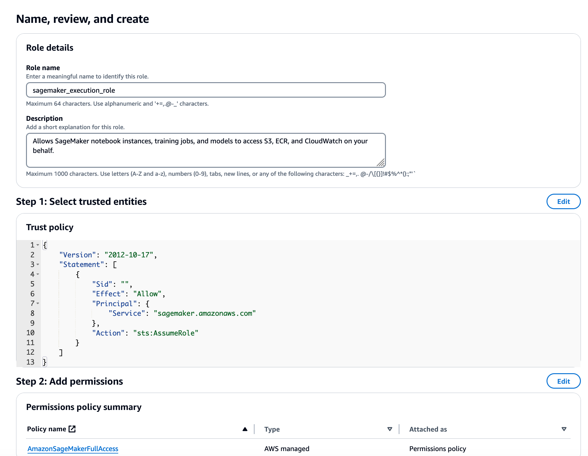
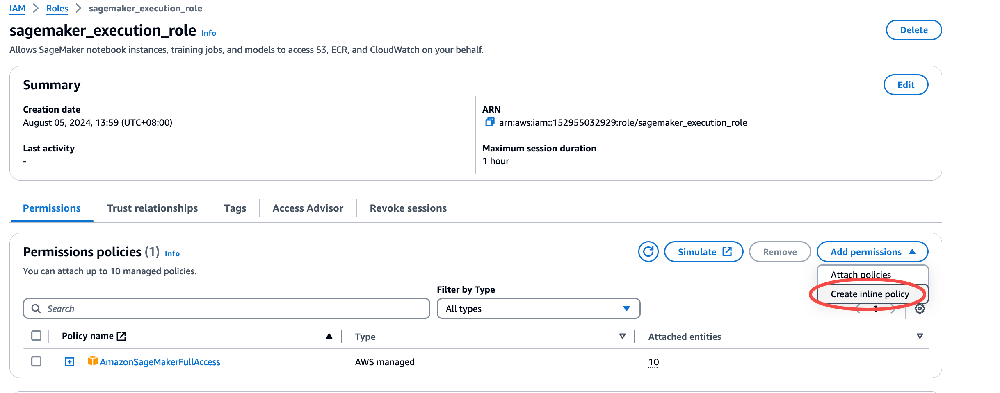
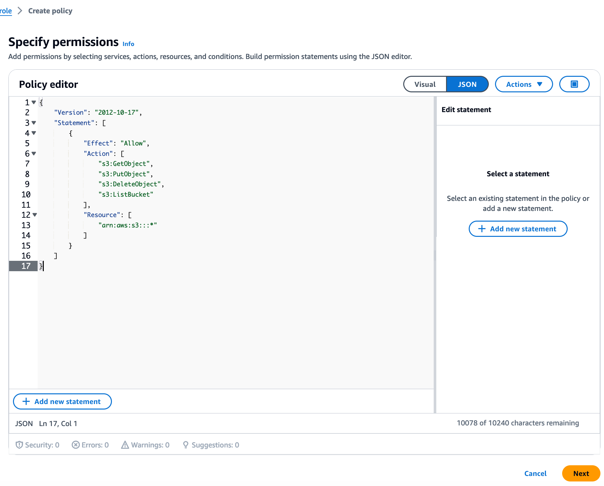

# Model Hub
Model Hub V2是提供一站式的模型微调，部署，调试的无代码可视化平台，可以帮助用户快速验证微调各类开源模型的效果，方便用户快速实验和决策，降低用户微调大模型的门槛。详情请见[飞书使用说明](https://amzn-chn.feishu.cn/docx/QniUdr7FroxShfxeoPacLJKtnXf)

## 1.环境安装
- 硬件需求：一台ec2 Instance, m5.xlarge, 200GB EBS storage
- os需求：ubuntu 22.04
- 配置权限：
1. 在IAM中创建一个ec2 role :adminrole-for-ec2.
- select trust type: AWS service, service: EC2, 
- 添加以下2个服务的权限，AmazonSageMakerFullAccess， CloudWatchLogsFullAccess
- 
- 
- 
- 把ec2 instance attach到role
-   


2. 创建一个AmazonSageMaker service role: sagemaker_exection_role



- 找到刚才的role，创建一个inline policy
- 
- 
- 注意，如果是中国区，需要把 "arn:aws:s3:::*"改成 "arn:aws-cn:s3:::sagemaker*"
```json
{
    "Version": "2012-10-17",
    "Statement": [
        {
            "Effect": "Allow",
            "Action": [
                "s3:GetObject",
                "s3:PutObject",
                "s3:DeleteObject",
                "s3:ListBucket"
            ],
            "Resource": [
                "arn:aws:s3:::sagemaker*"
            ]
        }
    ]
}
```
- ssh 到ec2 instance

- 如果是中国区，请先设置git代理
```bash
git config --global url."https://gitclone.com/".insteadOf https://
```
- 使用--recurse-submodule下载代码  
```bash
git clone --recurse-submodule https://github.com/xiehust/model_hub_v2.git
```

## 2.部署前端
1. 安装nodejs 18
```bash
curl -fsSL https://deb.nodesource.com/setup_18.x | sudo -E bash -
sudo apt install -y nodejs
sudo npm install --global yarn
```
2. 配置环境变量
- 修改model_hub_v2/env.sample 文件中,ip改成对应的ec2的ip，随机给一个api key，这个key需要与下一部分后端配置backend/.env中的apikey保持一致
```
REACT_APP_API_ENDPOINT=http://{ip}:8000/v1
REACT_APP_API_KEY=随机给一个key
```


3. 启动web page
- 安装yarn
```bash
yarn install
```

```bash
#install pm2
sudo yarn global add pm2
pm2 start pm2run.config.js 
```
- 以下是其他的管理命令(作为参考，不用执行):
```bash
pm2 list
pm2 stop modelhub
pm2 restart modelhub
pm2 delete modelhub
```

## 3.后端配置
请见[后端配置](./backend/README.md)

## 4.启动前端
- 以上都部署完成后，前端启动之后，可以通过浏览器访问http://{ip}:3000访问前端
- 如果需要做端口转发，则参考后端配置中的nginx配置部分