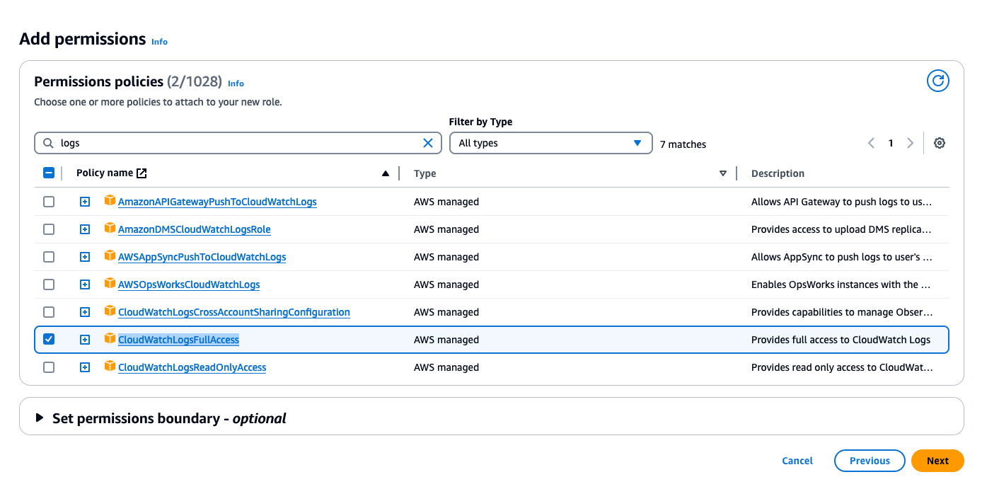

## 环境安装
- 硬件需求：一台ec2 Instance, m5.xlarge, 200GB EBS storage
- os需求：ubuntu 22.04
- 配置权限：
- 在IAM中创建一个role，select trust type: AWS service, service: EC2, policy: AmazonSageMakerFullAccess
- 
- 
- 

- 把ec2 instance attach到role
- 

## 后端配置
请见[后端配置](./backend/README.md)


## 如何启动前端
1. 安装nodejs 18
```bash
curl -fsSL https://deb.nodesource.com/setup_18.x | sudo -E bash -
sudo apt install -y nodejs
sudo npm install --global yarn
```

2. 前端启动
```bash
yarn install
yarn start
```


3. 使用PM2后台运行
```bash
#install pm2
sudo yarn global add pm2
pm2 start pm2run.config.js 
```
- 以下是其他的管理命令:
```bash
pm2 list
pm2 stop modelhub
pm2 restart modelhub
pm2 delete modelhub
```